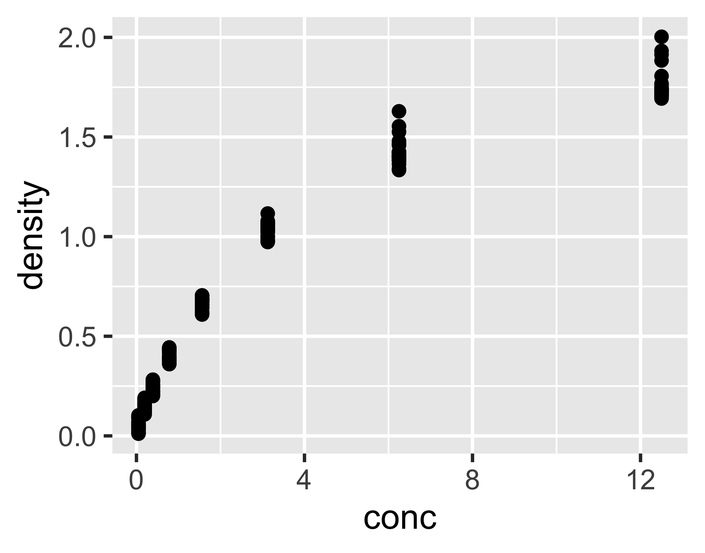
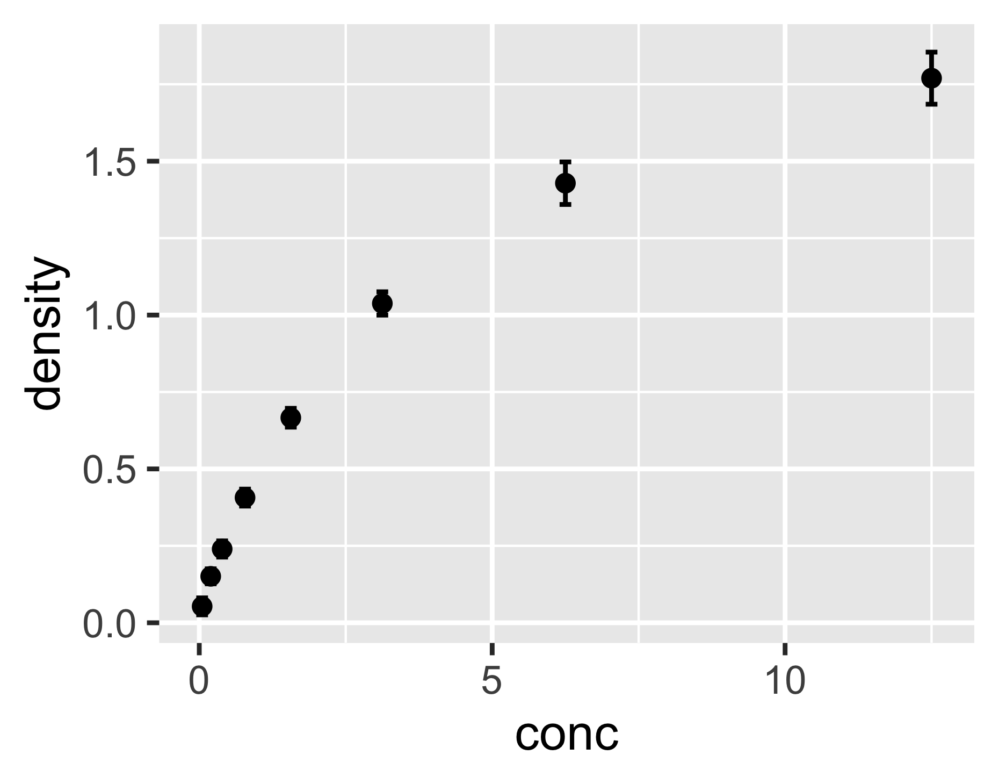
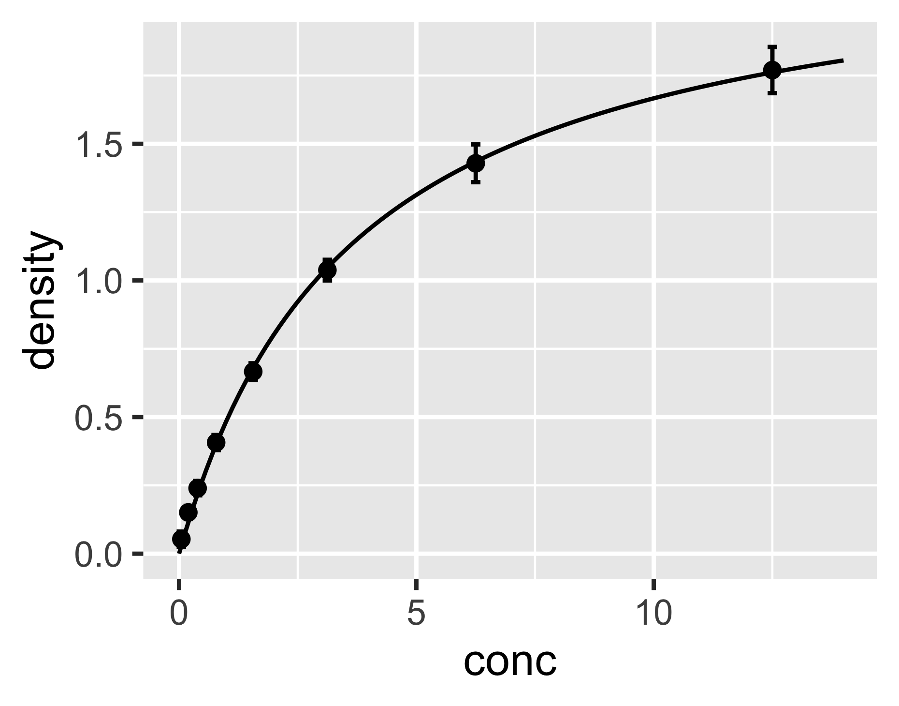
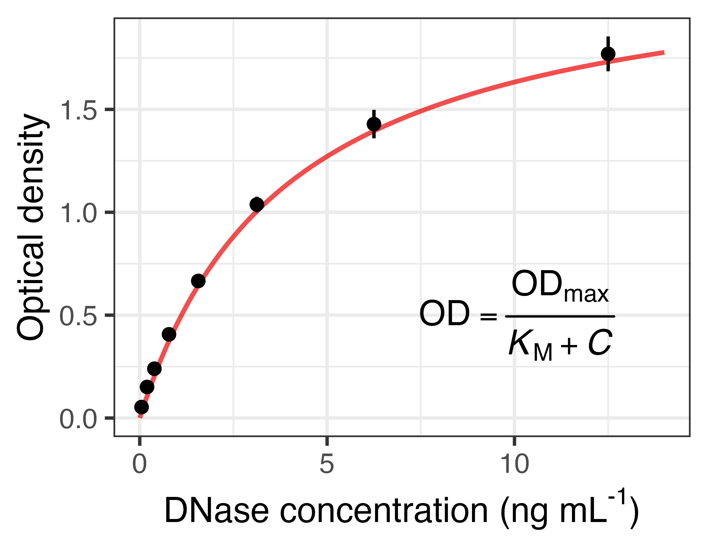
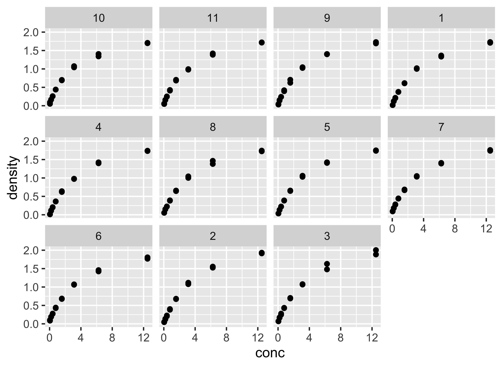
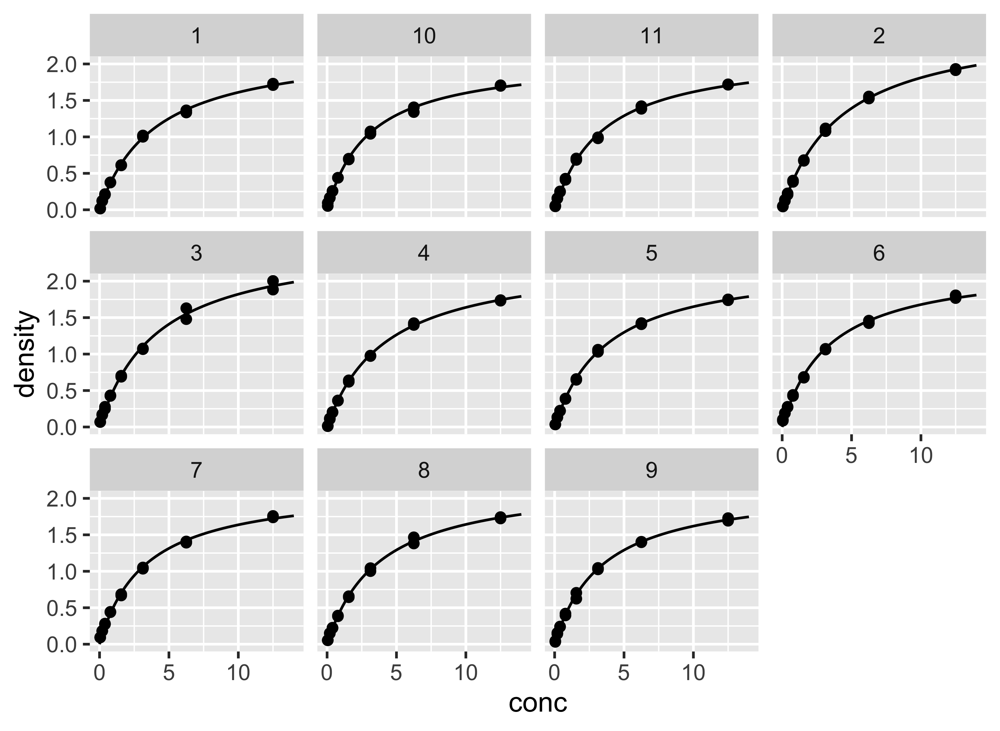
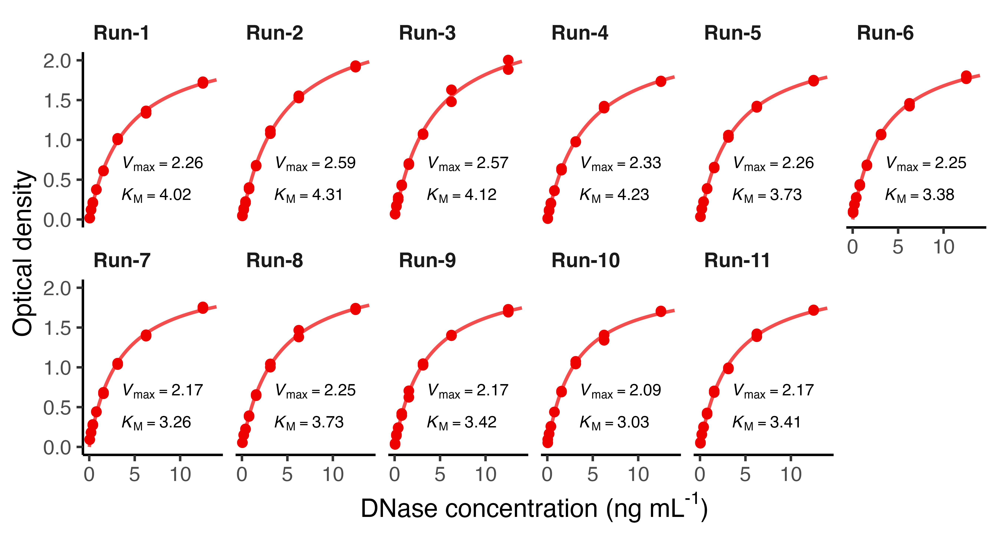

layout: true
  
<div class="my-footer"><span>Qiao-Guo Tan/CEE/XMU | tanqg@xmu.edu.cn | 2025-Mar-06   
&emsp;&emsp;&emsp;&emsp;&emsp;&emsp;&emsp;&emsp;&emsp;&emsp;&emsp;&emsp;&emsp;
&emsp;&emsp;&emsp;&emsp;&emsp;&emsp;&emsp;&emsp;&emsp;&emsp;&emsp;&emsp;&emsp;
</span></div> 


---
## 进阶：拟合及结果可视化  
* R自带的另一套数据**`DNase`**
> **Elisa assay of DNase**   
> Description  
> The DNase data frame has 176 rows and 3 columns of data obtained during development of an ELISA assay for the recombinant protein DNase in rat serum.  

> Source  
> Davidian, M. and Giltinan, D. M. (1995) Nonlinear Models for Repeated Measurement Data, Chapman & Hall (section 5.2.4, p. 134

###这套数据和我们研究中遇到的数据很类似。用ELISA方法测定大鼠血清中的DNA酶，得到酶浓度和吸光度数据。实验做了11次，每次测定有平行样。

---

## 先用**`head()`**和**`str()`**来查看数据  
.pull-left37[
```{r }
head(DNase)
```
]
--
.pull-right37[
```{r highlight.output = 2:4}
str(DNase)
```
]
???

注意：`Run`虽然是数字，类型却是`factor`，因此后面`facet`时可以直接操作，而无需转化为`factor`。
---
## 散点图是探索性分析的法宝  


.pull-left[

```r
library(ggplot2)
ggplot(DNase, aes(conc, density))+
  geom_point()
```
]

.pull-right[

```{r echo=F, message=F, warning= F}

```
]

---
class: inverse, center
<br>
<br>
<br>
## 这个数据让你想起了什么？

--

## 有点像酶反应里的米氏动力学

--
## 确定分析方向：用米氏方程去拟合数据


---
## 均值+标准差（换一种方法）
画误差棒的两种方法：  
`stat_summary(geom = "errorbar", ...)`  
`geom_errorbar(stat = "summary", ...)`

.pull-left[
```r
ggplot(DNase, aes(conc, density))+
*  geom_point(stat="summary", fun="mean")+
*  geom_errorbar(stat="summary", fun.min=function(x) mean(x)-sd(x), fun.max=function(x) mean(x)+sd(x), width=0.2)

```
]

.pull-right[
```{r echo=F, message=F, warning= F}


```
]
---
## 对比两种等价的作图方法  


方法1             |   方法2  
------------|----------------
`geom_errorbar(stat = "summary", ...)` | `stat_summary(geom = "errorbar",...)`
`geom_point(stat = "summary",...)` | `stat_summary(geom = "point",...)`
`geom_line(stat = "summary",...)` | `stat_summary(geom = "line",...)`
... | ...

---

## **`nls()`**非线性拟合米氏方程：手动提取拟合结果  

- 米氏方程： $V=\frac{V\text{max}\times C}{K_\text{M}+C}$

- 非线性拟合  
拟合前，观察原始数据，大致判断.red[Vmax]和.red[KM]的值
.pull-left67[
```{r highlight.output = 4:5}
nls(density ~ conc * Vmax/(KM + conc), 
    data = DNase, 
    start = list(Vmax = 2, KM = 6))
```
]

--

.pull-right67[

- 手动赋值
```{r}
Vmax <- 2.280 
KM <- 3.682
```

]

---

## **`nls()`**非线性拟合米氏方程：自动提取拟合结果-1  

- 将拟合结果存入**`fit`**

```{r }
fit <- nls(density ~ conc * Vmax/(KM + conc), data = DNase, start = list(Vmax = 2, KM = 6))
```

--

- 查看结果  
```{r highlight.output=6:7}
summary(fit)
```

---

## **`nls()`**非线性拟合米氏方程：自动提取拟合结果-2  

- 查看`summary`里储存了哪些信息  
```{r}
names(summary(fit)) 
```

--

- 提取我们需要的参数拟合值  

```{r}
coefficients(fit) #或者summary(fit)$coefficients

Vmax <- coefficients(fit)[1]

KM <- coefficients(fit)[2]
```

---

## 生成画拟合线所需的数据  

- 生成数据  

```{r}
fit_x <- seq(0, 14, length.out = 100) #生成100个x，涵盖原始数据范围
fit_y <- Vmax * fit_x /(KM + fit_x) #将x和参数值代入米氏方程，计算y


d_fit <- data.frame(conc = fit_x, density = fit_y) #注意命名和原数据保持一致，可以不一致，但一致的话画图更简单
```

--

- 查看一下所生成的数据  

```{r}
head(d_fit)
```


---
## 添加拟合线

.pull-left[
```r
ggplot(DNase, aes(conc, density))+
  geom_point(stat = "summary", fun = "mean")+
  geom_errorbar(stat = "summary", 
                fun.min = function(x) 
                mean(x) - sd(x), 
                fun.max = function(x) 
                mean(x) + sd(x), 
                width = 0.2)+
* geom_line(data = d_fit) #不需要设定aes(x = , y = )，因为继承了第1行代码的设定；如果x,y名字与原数据不一样，则需设定。

```
]


.pull-right[

```{r echo=FALSE, warning=FALSE}



```

]


---
## 修饰细节  

.pull-left[
```r
ggplot(DNase, aes(conc, density))+
  theme_bw()+
  geom_line(data = d_fit, linewidth = 0.7, 
            alpha = 0.7, color = "red2")+
  geom_point(stat = "summary", 
  fun = "mean")+
  geom_errorbar(stat = "summary", 
                fun.min = function(x) 
                mean(x) - sd(x), 
                fun.max = function(x) 
                mean(x) + sd(x), 
                width = 0)+
  labs(x=expression("DNase concentration (ng mL"^"-1"*")"),
       y="Optical density")+
* annotate(geom = "text", x = 10, y = 0.5,
             label = expression(OD==frac(OD[max], 
             italic(K)[M]+italic(C)))) # 添加公式
```
]

.pull-right[
```{r echo=FALSE, warning=FALSE, message=FALSE}

```
]

---
## 如何在图上添加数学公式？

1. `annotate(geom="text", x = ..., y = ..., label = ...)`
1. .red[`?plotmath`]查看各种公式的代码，例如：  

--

.pull-left[
Syntax |	Meaning 
-------|-------------
x + y	|x plus y 
x - y	|x minus y 
x %+-% y	|x plus or minus y
x %.% y	|x cdot y 
x[i]	|x subscript i 
x^2	 |x superscript 2 
]

.pull-right[

Syntax |	Meaning
---------|-------------
sqrt(x)	|square root of x
x == y	|x equals y
italic(x)	|draw x in italic font
alpha -- omega	|Greek symbols
frac(x, y)	|x over y
... | ...

]

---

## 另一个探索数据的超级武器：分面**`facet`**


.pull-left[
**有两种分面：**  
- `facet_wrap(~因子)`：针对1个因子，1维分面  
- `facet_grid(因子1~因子2)`：针对2个因子，2维分面  

```r

ggplot(DNase, aes(conc, density))+
  geom_point()+
* facet_wrap(~Run) # 针对Run这个因子分面
```
]

.pull-right[
- **每个Run都单独作图，数据趋势类似**  
- **每组数据可以单独拟合，可查参数的变异程度**  
  
```{r echo=FALSE, warning=FALSE, message=FALSE}


```

]

---

## 运用`for()`循环语句，批量拟合11组数据


```{r}
Run_level <- unique(DNase$Run) # 有哪几组数据？
N <- length(Run_level) # 有几组数据？

Vmax_each <- numeric(N) #生成长度为N的向量，以备存储拟合值
KM_each <- numeric(N)

#运用循环语句，每次拟合1组数据
for (i in 1 : N) {
d_i <- subset(DNase, Run==Run_level[i]) #把第i组数据筛选出来
fit_i <- nls(density ~ conc * Vmax/(KM + conc), data = d_i, start = list(Vmax=2, KM=6)) #拟合第i组数据
Vmax_each[i] <- coefficients(fit_i)[1] #第拟合结果存入Vmax_each向量第i个位置
KM_each[i] <- coefficients(fit_i)[2] #同上
}
```

--

- 将拟合值存入数据表备用
```{r}
d_Vmax_KM <- data.frame(Vmax_each, KM_each, Run = Run_level) 

```


---

##查看一下11组拟合结果

.pull-left[
```{r}
d_Vmax_KM


```
]

--
.pull-right[
```{r}
mean(Vmax_each)
sd(Vmax_each)
mean(KM_each)
sd(KM_each)

```
]

---
## 生成画11条拟合线的数据

```{r}
fit_x_11 <- rep(seq(0, 14, length.out = 100), times = 11) #生成等间距x值100个，重复11次
Vmax_11 <- rep(Vmax_each, each = 100) #复制Vmax，复制100份
KM_11 <- rep(KM_each, each = 100) #复制KM，复制100份
fit_y_11 <- Vmax_11 * fit_x_11 /(KM_11 + fit_x_11) #将以上三者代入米氏方程，计算y（想象一下你熟悉的excel，操作其实是一样的）
Run <- rep(Run_level, each = 100) #复制Run编号，复制100份

d_fit_11 <- data.frame(conc = fit_x_11, density = fit_y_11, Run = Run)
```

---
## 画11条拟合线  

.pull-left[
```r 

ggplot(DNase, aes(conc, density))+
  geom_point()+
  facet_wrap(~Run)+
* geom_line(data = d_fit_11) # 把11条拟合线画上去

```
]

.pull-right[
  
```{r echo=FALSE, warning=FALSE, message=FALSE}

```
]

---

## 修改细节  


```r
#把Run重新排序，并改名
DNase$Run_new <- factor(DNase$Run,
                        levels=c("1","2","3","4","5","6","7","8","9","10","11"),
                        labels = paste0("Run-", 1:11)) 
#每套数据都要改                   
d_fit_11$Run_new <- factor(d_fit_11$Run,
                           levels=c("1","2","3","4","5","6","7","8","9","10","11"),
                           labels = paste0("Run-", 1:11)) 
d_Vmax_KM$Run_new <- factor(d_Vmax_KM$Run,
                            levels=c("1","2","3","4","5","6","7","8","9","10","11"),
                            labels = paste0("Run-", 1:11))                     
# 生成标注Vmax和KM的标签
d_Vmax_KM$label_1 <- paste0("~italic(V)[max]==", round(d_Vmax_KM$Vmax_each, 2))
d_Vmax_KM$label_2 <- paste0("~italic(K)[M]==", round(d_Vmax_KM$KM_each, 2))    

```

---

## 修改细节  


```r
ggplot(DNase, aes(conc, density))+
  theme_classic()+ #经典主题
  geom_point(color = "red2")+
  facet_wrap(~Run_new, nrow = 2)+ #两行
  geom_line(data = d_fit_11, size = 0.7, alpha = 0.7, color = "red2")+ #拟合线
  labs(x = expression("DNase concentration (ng mL"^"-1"*")"),
       y = "Optical density")+
  geom_text(data = d_Vmax_KM, x = 3, y = 0.7, hjust = 0, size = 2.5,
            aes(label = label_1), parse = T)+ #标注Vmax
  geom_text(data = d_Vmax_KM, x=3, y= 0.3, hjust = 0, size = 2.5,
            aes(label = label_2), parse = T)+ #标注KM
  theme(strip.background = element_blank(),
        strip.text = element_text(face = "bold", hjust = 0)) # 分面标签格式 

```

---
  
```{r echo=FALSE, warning=FALSE, message=FALSE}

```


???
ggsave("DNase_7.png", width = 539/90, height = 292/90, dpi = 900)
---
## 图上各主题元素的修改方法
参考此网页：https://ggplot2.tidyverse.org/reference/theme.html  
网页用夸张的例子演示了如何个性化修改图的每一部分。绝大多数时候，我们采用默认设置即可。但若确实需要修改，你都可以做到。
---
## 多图组合

程序包：`patchwork`和`cowplot` 
* `cowplot` https://wilkelab.org/cowplot/articles/index.html

* `patchwork` https://patchwork.data-imaginist.com/


---
## 要点小结

**理解两种等价的作图方式**
- `geom_xxx(stat="summary") == stat_summary(geom="xxx")` 

**添加拟合线** 
- `nls()`非线性拟合 
- `summary()`查看、提取拟合结果
- `seq()`，`rep()`生成作图数据的有力工具

**添加数学公式**
- `annotate()` 往图上添加公式、文字
- `?plotmath` 查看数学公式对应的代码

**`facet`分面功能**：数据分析的世界因此而美好

**`for()`循环语句**：把重复的工作交给电脑


